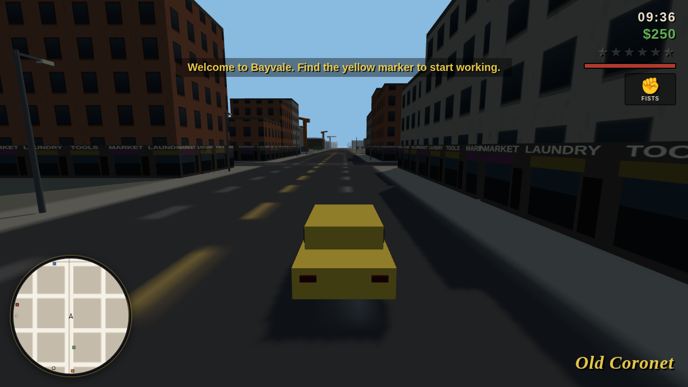

# BAYVALE

An original open-world action game for the browser, built from scratch with
Three.js. One city, nine vehicle types, six weapons, a six-star wanted system,
living traffic and pedestrians, a 12-mission story, and a fully procedural
soundtrack — with **zero asset files**: every texture is painted onto a canvas
at boot, every model is generated geometry, and every sound (including the
three radio stations) is synthesized live with WebAudio.



## Run it

```bash
npm install        # vendors are committed; this just ensures three.js exists
npx http-server -p 8080
# open http://localhost:8080
```

Any static file server works — there is no build step. Chrome/Edge/Firefox,
desktop recommended (keyboard + mouse).

## The game

You are **Marco Reyes**, back in your home town of Bayvale after six years
away, working your way up from taxi errands for your cousin **Rosa** to
dismantling **Ray Corvo**'s grip on the city, one mission at a time.

- **Open world** — a 1.8 km × 1.8 km island city with nine districts
  (downtown towers, old-town shopfronts, suburbs, docks, beach, park,
  hillside estates, farmland), a full day/night cycle, and district name
  popups as you cross borders.
- **Vehicles** — sedans, sports cars, taxis, pickups, vans, buses, bikes,
  ambulances, police cruisers. Arcade handling with handbrake drifts, visual
  damage → smoke → fire → explosion, headlights at night, horns, and carjacking.
- **Combat** — fists, bat, pistol, SMG, shotgun, rifle. Over-shoulder aiming,
  reloads, drive-bys from car windows, and an armory shop.
- **Wanted system** — six stars of escalation: foot patrols, cruisers,
  roadblocks and tactical units. Break line of sight to cool off, or buy a
  respray. Get caught and you're **BUSTED**; go down and you're **WASTED**.
- **Missions** — 12 story missions across three contacts (drive, chase, tail,
  escort, defend, assault), plus taxi fares and 30 hidden lucky coins.
- **Progression** — money, weapons, armor, safehouse saving (localStorage),
  max-health reward for the full coin set.
- **Radio** — three generative stations (synthwave, latin, lo-fi) composed
  procedurally every time you listen.

## Controls

| Key | Action |
| --- | --- |
| W A S D | move / drive |
| Mouse | camera (click canvas to lock) |
| Shift | sprint |
| Space | jump / handbrake |
| LMB | attack / fire |
| RMB | hold to aim |
| Scroll / Q | switch weapon |
| F / Enter | enter or exit vehicle |
| R | reload · radio (in a vehicle) |
| H | horn |
| T | taxi fares (while driving a taxi) |
| M | map — click to set a waypoint (A* route on the minimap) |
| V | camera distance |
| Esc / P | pause |

## Testing

Headless smoke tests (Playwright + the game's `window.__game` debug API):

```bash
npx http-server -p 8080 &     # server must be running
node test/boot.mjs            # boot, walk, day/night, draw calls
node test/drive.mjs           # vehicle entry, driving, traffic, peds
node test/combat.mjs          # weapons, wanted stars, police, wasted flow
node test/missions.mjs        # mission chain, shops, save/load, routing
```

The tests fast-forward the simulation deterministically (`__game.tick`), so
they pass even on slow software renderers.

## Architecture

```
index.html            HUD DOM + import map (three.js vendored, no bundler)
src/main.js           boot, game loop, mode state machine, debug API
src/core/             input, third-person camera, audio synth, radio, save, RNG
src/world/            seeded city generator (road graph → districts → lots),
                      canvas textures, merged chunk meshes, terrain, day/night
src/entities/         humanoid rig, player, peds, cops, goons, vehicles
src/systems/          traffic, pedestrians, combat, wanted, missions,
                      world-life (shops/pickups/taxi/map), particles
src/ui/               HUD, rotating minimap
```

Everything in Bayvale — names, story, map, art, music — is original work
created for this project.
