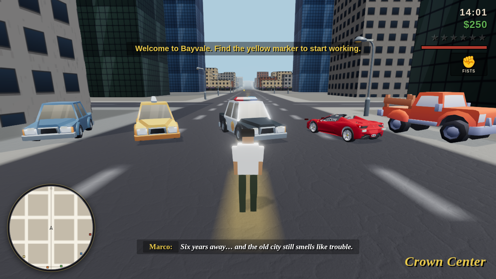

# BAYVALE

An original open-world action game for the browser, built from scratch with
Three.js — a living stylized-realistic city with cinematic lighting, real
rigged characters, ten vehicle types, a six-star wanted system, enterable
shops, intelligent role-based NPCs, first-person and third-person combat with
ragdolls, a 12-mission story, and a full generated soundtrack.

The city, story, characters and design are **100% original**. Real 3D models,
PBR textures and HDRIs come from CC0/MIT sources (see `ATTRIBUTION.md`); every
sound effect, voice line and radio track was **generated** with the ElevenLabs
API. The game degrades gracefully to procedural geometry/textures/audio if any
asset is missing, so it always runs.



## Run it

```bash
npm start          # zero-dependency Node server, respects $PORT (default 8080)
# open http://localhost:8080
```

No build step and no runtime dependencies — `server.js` uses only Node
built-ins, so it also works as-is on container platforms that run `npm start`.
Any other static server works too (e.g. `npx http-server -p 8080`).
Chrome/Edge/Firefox, desktop recommended (keyboard + mouse).

## The game

You are **Marco Reyes**, back in your home town of Bayvale after six years
away, working your way up from taxi errands for your cousin **Rosa** to
dismantling **Ray Corvo**'s grip on the city, one mission at a time.

- **Open world** — a 1.8 km × 1.8 km island city with nine palm-lined
  districts, ACES-tone-mapped cinematic lighting with bloom, HDRI sky, a
  day/night cycle that drives exposure and lit windows, parked cars on every
  block, working traffic lights, and drifting clouds over the bay.
- **Vehicles** — ten types (sedans, sports cars, taxis, pickups, vans, buses,
  bikes, ambulances, police cruisers, fire engines) using real 3D models with
  spinning/steering wheels, arcade drift handling, damage → smoke → fire →
  explosion, headlights, horns, carjacking and drive-bys.
- **Living NPCs** — rigged, animated pedestrians with six roles (commuters,
  tourists, joggers, elderly, vendors, gangsters), each with a personality
  that decides how they react: flee, cower, film you on their phone, fight
  back, or call the police. Beat cops patrol; firefighters respond to street
  fires; paramedics revive the wounded. Everyone reacts differently.
- **Enterable interiors** — walk into stores, diners, laundromats, the gun
  shop, the burger joint, a nightclub with dancers, and your safehouse.
  Hold a gun on a clerk to rob the register (heat rises when you step out).
- **Combat 2.0** — first-person and third-person, six weapons with recoil,
  tracers, ejected shells and muzzle flashes; melee combos with lunges,
  hit-stop and knockdowns; hard lock-on (Tab), dodge rolls, a weapon wheel;
  ragdoll physics and blood pools on every takedown.
- **Wanted system** — six stars: foot patrols → cruisers (with PIT maneuvers
  and rubber-banding) → roadblocks → tactical units → a searchlight
  helicopter. Break line of sight, or respray. **BUSTED** or **WASTED** on
  capture/death.
- **Missions** — 12 story missions across three contacts (drive, chase, tail,
  escort, defend, assault), plus taxi fares and 30 hidden lucky coins.
- **Audio** — generated weapon/vehicle/world SFX with distance + stereo pan,
  role-based voice barks, police-scanner chatter, ambient beds per district
  and time of day, and three radio stations of real music.
- **Progression** — money, weapons, armor, safehouse saving (localStorage),
  quality presets (Low/Med/High) with auto-degrade.

## Controls

| Key | Action |
| --- | --- |
| W A S D | move / drive |
| Mouse | camera (click canvas to lock) |
| Shift | sprint |
| Space | jump / handbrake · dodge roll (locked on) |
| LMB | attack / fire |
| RMB | hold to aim |
| Tab / MMB | lock on to target |
| Scroll | switch weapon |
| Hold Q | weapon wheel (slow-mo) |
| F / Enter | enter or exit vehicle |
| R | reload · radio (in a vehicle) |
| H | horn |
| T | taxi fares (while driving a taxi) |
| M | map — click to set a waypoint (A* route on the minimap) |
| V | camera: near / mid / far / first-person |
| Esc / P | pause (quality settings here) |

Walk into a glowing yellow door to enter a shop; the cyan marker inside is
the exit.

## Regenerating assets

Models, textures, HDRIs and audio are committed, so the game runs as-is.
To re-fetch or regenerate them:

```bash
node tools/fetch-assets.mjs                 # CC0/MIT models, textures, HDRIs
ELEVENLABS_API_KEY=sk_... node tools/gen-audio.mjs --all   # SFX, voice, music
```

The audio generator reads the key **only** from the environment — it is never
committed. If you were handed a key in chat, rotate it after use.

## Testing

Headless smoke tests (Playwright + the game's `window.__game` debug API):

```bash
npm start &                   # server on :8080
node test/boot.mjs            # boot, walk, day/night, draw calls
node test/drive.mjs           # vehicle entry, driving, traffic, peds
node test/combat.mjs          # weapons, wanted stars, police, wasted flow
node test/missions.mjs        # mission chain, shops, save/load, routing
node test/deep.mjs            # 6-star escalation, respray, soak
node test/npc.mjs             # archetypes, witnesses, fire/medic dispatch
node test/interiors.mjs       # enter/exit, robbery, bed save, counters
node test/g6.mjs              # first-person, ragdoll, lock-on, combos
node test/audio.mjs           # audio manifest + buffer playback
node test/chase.mjs           # PIT chase, helicopter
```

The tests fast-forward the simulation deterministically (`__game.tick`), so
they pass even on slow software renderers.

## Architecture

```
index.html            HUD DOM + import map (three.js vendored, no bundler)
src/main.js           boot, game loop, mode state machine, debug API
src/core/             input, third-person camera, audio synth, radio, save, RNG
src/world/            seeded city generator (road graph → districts → lots),
                      canvas textures, merged chunk meshes, terrain, day/night
src/entities/         humanoid rig, player, peds, cops, goons, vehicles
src/systems/          traffic, pedestrians, combat, wanted, missions,
                      world-life (shops/pickups/taxi/map), particles
src/ui/               HUD, rotating minimap
```

Everything in Bayvale — names, story, map, art, music — is original work
created for this project.
